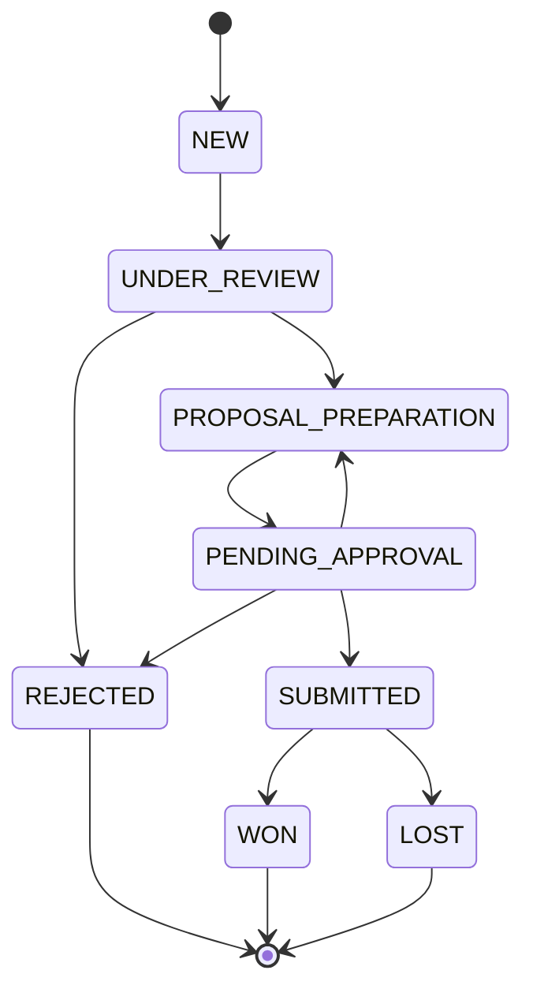
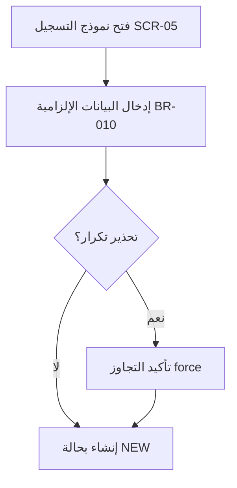

# Tender UX/Design Documentation Package Implementation Plan

> **For agentic workers:** REQUIRED SUB-SKILL: Use superpowers:subagent-driven-development (recommended) or superpowers:executing-plans to implement this plan task-by-task. Steps use checkbox (`- [ ]`) syntax for tracking.

**Goal:** Author the first batch of 4 grounded design documents for the Smart Tender Management System, tying every screen to a role, state, business rule, and action via shared traceability IDs.

**Architecture:** Four Markdown documents in `docs/design/`, plus an index README. Each document is grounded in the existing code (Prisma schema, RBAC middleware, tenders route, Arabic labels) and the project prompt. Documents cross-reference via stable IDs (`BR/ACT/SCR/JRN`). Diagrams use Mermaid. Content is Arabic RTL; technical identifiers stay in English as in code.

**Tech Stack:** Markdown, Mermaid (state diagrams + flowcharts), GitHub-flavored tables.

## Global Constraints

- Location: all deliverables under `docs/design/`. (Spec doc already at `docs/superpowers/specs/2026-07-21-tender-design-docs-design.md`.)
- Language: Arabic content, RTL. Technical identifiers in English exactly as in code: `PROPOSAL_PREPARATION`, `BR-004`, `requireRole`.
- Role labels — use verbatim from `apps/web/src/lib/labels.ts`: ADMIN=مسؤول النظام, QA=مراجع الجودة, WRITER=كاتب العروض, MANAGER=المدير, OWNER=المالك.
- Status labels — use verbatim from `labels.ts`: NEW=جديدة, UNDER_REVIEW=قيد المراجعة, REJECTED=مستبعدة, PROPOSAL_PREPARATION=إعداد العرض, PENDING_APPROVAL=بانتظار الاعتماد, SUBMITTED=مقدَّمة, WON=فوز, LOST=خسارة.
- Every element tagged `✅ منفّذ` or `🔷 مخطّط` per current code (M0–M2 implemented; state-machine transitions M3+ planned).
- Business rules source: `CLAUDE_CODE_PROMPT_Tender_System.md` — BR-001, BR-002, BR-003, BR-004, BR-005, BR-008, BR-010, BR-011 (note: catalogue must state that BR-006/007/009 are not defined in the prompt).
- Implemented facts (do not contradict): `POST /tenders` requires QA only; `PATCH /tenders/:id` requires QA/MANAGER/ADMIN; GET list/details require auth (any role); duplicate check on url OR (title+entity), bypassable with `?force=1`; create sets status=NEW and currentAssignee=creator; state-transition endpoints do NOT yet exist.
- Every Mermaid block must be valid and render without syntax errors.

---

### Task 1: Package index + business rules catalogue

**Files:**

- Create: `docs/design/README.md`
- Create: `docs/design/01-business-rules-catalogue.md`

**Interfaces:**

- Produces: canonical `BR-xxx` catalogue with per-rule status tags; the state-transition table (from→to, responsible role, rule, status) that Tasks 2 and 3 reference; the state-machine Mermaid diagram. Produces the `docs/design/README.md` index listing all four docs (Tasks 3 and 4 files listed as planned until created).

- [ ] **Step 1: Write the business rules catalogue**

Create `docs/design/01-business-rules-catalogue.md` with, in Arabic RTL:

1. Intro paragraph: purpose, source (`CLAUDE_CODE_PROMPT_Tender_System.md`), and the ✅/🔷 tagging convention.
2. **Business rules table** with columns: `المعرّف | الوصف | أين تُنفَّذ | الإجراءات المرتبطة | الحالة`. Rows for BR-001, BR-002, BR-003, BR-004, BR-005, BR-008, BR-010, BR-011. Content per rule:
   - BR-001: لا تحويل لإعداد العرض قبل اكتمال الـChecklist — backend transition guard — ACT-04/ACT-05 — 🔷 مخطّط.
   - BR-002: سبب الرفض إلزامي — backend — ACT-06 — 🔷 مخطّط.
   - BR-003: مسؤول واحد فقط لكل مناقصة — حقل `currentAssigneeId` — ACT-05/ACT-09 — ✅ منفّذ (الحقل موجود؛ يُضبط عند الإنشاء).
   - BR-004: لا تقديم بدون اعتماد المدير — حقل `managerApprovedAt` — ACT-07/ACT-08/ACT-10 — 🔷 مخطّط.
   - BR-005: لا تُغلق مناقصة مُقدَّمة بدون نتيجة — backend — ACT-11 — 🔷 مخطّط.
   - BR-008: كل إجراء جوهري يُسجَّل في Audit Log — `logAudit()` في `lib/audit.ts` — كل الإجراءات — ✅ منفّذ (للإنشاء والتعديل).
   - BR-010: موعد الإغلاق والجهة المعلنة إلزاميان — `closingDate`/`entity` NOT NULL — ACT-01 — ✅ منفّذ.
   - BR-011: إعادة العرض تتطلب ملاحظات إلزامية — backend — ACT-09 — 🔷 مخطّط.
3. A note line: "BR-006, BR-007, BR-009 غير مُعرَّفة في البرومبت الحالي — محجوزة."
4. **State Transition Diagram** — Mermaid `stateDiagram-v2`:



5. **Transitions table** columns: `من | إلى | الدور المسؤول | القاعدة | الحالة`. One row per edge above:
   - NEW→UNDER_REVIEW — QA — — 🔷
   - UNDER_REVIEW→PROPOSAL_PREPARATION — QA — BR-001 — 🔷
   - UNDER_REVIEW→REJECTED — QA — BR-002 — 🔷
   - PROPOSAL_PREPARATION→PENDING_APPROVAL — WRITER — BR-004 — 🔷
   - PENDING_APPROVAL→SUBMITTED — MANAGER — BR-004 — 🔷
   - PENDING_APPROVAL→PROPOSAL_PREPARATION — MANAGER — BR-011 — 🔷
   - PENDING_APPROVAL→REJECTED — MANAGER — BR-002 — 🔷
   - SUBMITTED→WON — MANAGER — BR-005 — 🔷
   - SUBMITTED→LOST — MANAGER — BR-005 — 🔷
6. **Decision Table** — القبول/الرفض/الإعادة: columns `الشرط | القرار | القاعدة`. Rows: Checklist مكتمل→تحويل لإعداد العرض (BR-001); Checklist ناقص→يبقى قيد المراجعة (BR-001); طلب ناقص بيانات→رفض بسبب (BR-002); عرض يحتاج تعديل→إعادة للكاتب بملاحظات (BR-011); اعتماد المدير موجود→يسمح بالتقديم (BR-004).

- [ ] **Step 2: Write the package index**

Create `docs/design/README.md` in Arabic RTL: title "حزمة توثيق UX/Design — نظام المناقصات", a one-line purpose, the ✅/🔷 convention, and a table of the four documents with links: `01-business-rules-catalogue.md` (✅ مكتمل), `02-roles-permissions-matrix.md`, `03-user-journeys.md`, `04-screen-inventory-and-specs.md`. Add a "المعرّفات المشتركة" section briefly defining the BR/ACT/SCR/JRN prefixes. Reference the source spec at `docs/superpowers/specs/2026-07-21-tender-design-docs-design.md`.

- [ ] **Step 3: Verify labels, IDs, and Mermaid**

Run: `grep -oE "BR-0[0-9]{2}" docs/design/01-business-rules-catalogue.md | sort -u`
Expected: exactly BR-001, BR-002, BR-003, BR-004, BR-005, BR-008, BR-010, BR-011.

Run: `grep -c "جديدة\|قيد المراجعة\|إعداد العرض\|بانتظار الاعتماد\|مقدَّمة" docs/design/01-business-rules-catalogue.md`
Expected: non-zero (Arabic status labels present).

Manually confirm the Mermaid block opens with ` ```mermaid ` and closes with ` ``` `, and every state name matches the `TenderStatus` enum exactly.

- [ ] **Step 4: Commit**

```bash
git add docs/design/README.md docs/design/01-business-rules-catalogue.md
git commit -m "docs(design): add business rules catalogue + package index"
```

---

### Task 2: Roles & permissions matrix

**Files:**

- Create: `docs/design/02-roles-permissions-matrix.md`

**Interfaces:**

- Consumes: `BR-xxx` and the transitions table from Task 1 (`01-business-rules-catalogue.md`).
- Produces: the canonical `ACT-01…ACT-13` action catalogue that Tasks 3 and 4 reference by ID.

- [ ] **Step 1: Write the roles & permissions matrix**

Create `docs/design/02-roles-permissions-matrix.md` in Arabic RTL:

1. Intro: purpose, and that role labels/permissions are grounded in `apps/api/src/middleware/auth.ts` and `apps/api/src/routes/*`.
2. **Action catalogue table** `المعرّف | الإجراء | القاعدة | الحالة` — ACT-01..ACT-13 exactly as in the spec §4.1:
   - ACT-01 تسجيل مناقصة / BR-010 / ✅ (QA)
   - ACT-02 تعديل بيانات المناقصة / — / ✅ (QA/MANAGER/ADMIN)
   - ACT-03 عرض قائمة/تفاصيل / — / ✅ (الكل)
   - ACT-04 تطبيق/تحديث الـChecklist / BR-001 / 🔷
   - ACT-05 تحويل لإعداد العرض / BR-001 / 🔷
   - ACT-06 استبعاد/رفض (بسبب) / BR-002 / 🔷
   - ACT-07 إرسال للاعتماد / BR-004 / 🔷
   - ACT-08 اعتماد العرض / BR-004 / 🔷
   - ACT-09 إعادة للكاتب (بملاحظات) / BR-011 / 🔷
   - ACT-10 تسجيل التقديم / BR-004 / 🔷
   - ACT-11 تسجيل النتيجة (Won/Lost) / BR-005 / 🔷
   - ACT-12 إدارة المستخدمين والأدوار / — / ✅ (ADMIN)
   - ACT-13 رفع/إدارة المرفقات / — / 🔷
3. **Permissions matrix** — rows = ACT-01..ACT-13, columns = QA, WRITER, MANAGER, OWNER, ADMIN, cells = نعم / لا / محدود. Follow the prompt's role responsibilities: QA→ACT-01/02/03/04/05/06; WRITER→ACT-03/07/13; MANAGER→ACT-02/03/08/09/10/11; OWNER→ACT-03 (قراءة فقط) نعم والباقي لا; ADMIN→ACT-02/03/12 (لا يشارك في سير عمل المناقصة). Every OWNER cell except ACT-03 = لا.
4. **State transitions by role** — restate the Task 1 transitions grouped by responsible role (QA / WRITER / MANAGER).
5. **Implementation notes (فجوات RBAC):** a table `الإجراء | ما يفرضه الكود حاليًا | المطلوب`. Include: ACT-01 → `requireRole('QA')` ✅ مطابق; ACT-02 → `requireRole('QA','MANAGER','ADMIN')` — ملاحظة: الكود يسمح بالتعديل في أي حالة بلا قيد حالة؛ المطلوب لاحقًا تقييده؛ ACT-04..ACT-11 → لا تُوجد endpoints بعد (🔷).

- [ ] **Step 2: Verify action IDs and role coverage**

Run: `grep -oE "ACT-[0-9]{2}" docs/design/02-roles-permissions-matrix.md | sort -u`
Expected: ACT-01 through ACT-13, no gaps.

Run: `grep -c "مراجع الجودة\|كاتب العروض\|المدير\|المالك\|مسؤول النظام" docs/design/02-roles-permissions-matrix.md`
Expected: non-zero (all five role labels present).

- [ ] **Step 3: Commit**

```bash
git add docs/design/02-roles-permissions-matrix.md
git commit -m "docs(design): add roles & permissions matrix with RBAC gaps"
```

---

### Task 3: User journeys

**Files:**

- Create: `docs/design/03-user-journeys.md`

**Interfaces:**

- Consumes: `BR-xxx` + transitions (Task 1), `ACT-xx` (Task 2). References `SCR-xx` by ID (defined in Task 4) — list the SCR IDs used here so Task 4 covers them: SCR-01 login, SCR-02 home/dashboard, SCR-03 tenders list, SCR-04 tender details, SCR-05 tender form, SCR-06 admin users.
- Produces: `JRN-01…JRN-07` journey IDs referenced by Task 4 screens.

- [ ] **Step 1: Write the user journeys document**

Create `docs/design/03-user-journeys.md` in Arabic RTL. Intro: purpose + that each journey maps steps to role, state, rule, screen, and failure point. Then one section per journey; each has a Mermaid `flowchart TD` and a steps table `الخطوة | الدور | الحالة قبل | الحالة بعد | القاعدة | الشاشة | نقطة فشل محتملة`:

- **JRN-01 تسجيل مناقصة** (QA, ACT-01): يفتح نموذج التسجيل (SCR-05) → يدخل البيانات الإلزامية (BR-010) → تحذير تكرار قابل للتجاوز (`force`) → تُنشأ بحالة NEW. فشل: بيانات ناقصة / تجاهل تحذير تكرار.
- **JRN-02 مراجعة QA** (QA, ACT-04/05/06): يفتح التفاصيل (SCR-04) → يطبّق الـChecklist (BR-001) → إما تحويل لإعداد العرض (→PROPOSAL_PREPARATION) أو استبعاد بسبب (BR-002 →REJECTED). فشل: Checklist ناقص يمنع التحويل.
- **JRN-03 إعداد العرض** (WRITER, ACT-13/07): يستلم المناقصة → يرفع المرفقات → يرسل للاعتماد (→PENDING_APPROVAL, BR-004). فشل: إرسال بلا مرفقات مطلوبة.
- **JRN-04 اعتماد المدير** (MANAGER, ACT-08/09): يراجع → يعتمد (→SUBMITTED عبر التقديم) أو يعيد للكاتب بملاحظات (BR-011 →PROPOSAL_PREPARATION). فشل: إعادة بلا ملاحظات.
- **JRN-05 التقديم** (MANAGER, ACT-10): بعد الاعتماد (`managerApprovedAt`, BR-004) → يسجّل التقديم (→SUBMITTED). فشل: تقديم بلا اعتماد.
- **JRN-06 تسجيل النتيجة** (MANAGER, ACT-11): يسجّل Won أو Lost (BR-005 →WON/LOST). فشل: إغلاق بلا نتيجة.
- **JRN-07 متابعة/قراءة** (OWNER, ACT-03): يفتح القوائم والتقارير للقراءة فقط (SCR-02/03/04). فشل: محاولة إجراء غير مسموح → عدم صلاحية.

Example Mermaid for JRN-01 (each journey gets its own analogous flowchart):



- [ ] **Step 2: Verify cross-references**

Run: `grep -oE "JRN-0[0-9]" docs/design/03-user-journeys.md | sort -u`
Expected: JRN-01 through JRN-07.

Run: `grep -oE "SCR-0[0-9]" docs/design/03-user-journeys.md | sort -u`
Expected: subset of SCR-01..SCR-06 (all must be covered by Task 4).

Run: `grep -c "mermaid" docs/design/03-user-journeys.md`
Expected: 7 (one flowchart per journey).

- [ ] **Step 3: Commit**

```bash
git add docs/design/03-user-journeys.md
git commit -m "docs(design): add user journeys mapped to states, rules, screens"
```

---

### Task 4: Screen inventory & specs + final consistency pass

**Files:**

- Create: `docs/design/04-screen-inventory-and-specs.md`
- Modify: `docs/design/README.md` (mark all four docs complete)

**Interfaces:**

- Consumes: `SCR-01..SCR-06` (referenced in Task 3), roles (Task 2), states (Task 1), `JRN-xx` (Task 3).

- [ ] **Step 1: Write the screen inventory & specs**

Create `docs/design/04-screen-inventory-and-specs.md` in Arabic RTL. Intro + a **screen inventory table** `المعرّف | الشاشة | الملف | من يراها | الحالة`, grounded in `apps/web/src/pages/*`:

- SCR-01 تسجيل الدخول — `LoginPage.tsx` — الكل — ✅
- SCR-02 الرئيسية/لوحة المعلومات — `HomePage.tsx` — الكل حسب الدور — ✅
- SCR-03 قائمة المناقصات — `TendersPage.tsx` — الكل — ✅
- SCR-04 تفاصيل المناقصة — `TenderDetailsPage.tsx` — الكل — ✅
- SCR-05 نموذج المناقصة — `TenderFormPage.tsx` — QA — ✅
- SCR-06 إدارة المستخدمين — `AdminUsersPage.tsx` — ADMIN — ✅

Then one **spec subsection per screen** with: الهدف؛ من يراها (الأدوار)؛ الحقول (الإلزامي منها)؛ الرحلات المرتبطة (`JRN-xx`)؛ و**جدول الحالات** `الحالة | السلوك` covering exactly: فارغ، تحميل، نجاح، خطأ، عدم صلاحية، انتهاء الجلسة. Ground field lists in real code: SCR-05 fields = title, entity, closingDate (إلزامي BR-010), source, url, description; SCR-04 shows currentAssignee + statusHistory + checklist + attachments; SCR-03 has filters (status, entity, assignee, closing date, q) + pagination + sort by closingDate. For عدم صلاحية use the real message "ليست لديك صلاحية لهذا الإجراء"; for انتهاء الجلسة use "جلسة غير صالحة، سجّل الدخول مجددًا".

- [ ] **Step 2: Update the index**

Edit `docs/design/README.md`: mark all four documents ✅ مكتمل in the documents table.

- [ ] **Step 3: Cross-document consistency verification**

Run: `grep -oE "SCR-0[0-9]" docs/design/03-user-journeys.md docs/design/04-screen-inventory-and-specs.md | grep -oE "SCR-0[0-9]" | sort -u`
Expected: every SCR ID used in Task 3 appears in Task 4.

Run: `grep -rho "ACT-[0-9][0-9]" docs/design/ | sort -u | wc -l`
Expected: 13 (ACT-01..ACT-13 all referenced somewhere).

Run: `grep -rl "قيد الدراسة\|تحت المراجعة\|تحت الاعتماد" docs/design/`
Expected: no output (no off-spec status synonyms — only the labels from `labels.ts` are used).

- [ ] **Step 4: Commit**

```bash
git add docs/design/04-screen-inventory-and-specs.md docs/design/README.md
git commit -m "docs(design): add screen inventory & specs, complete package"
```

---

## Self-Review

**Spec coverage:** §5.1 → Task 1; §5.2 → Task 2; §5.3 → Task 3; §5.4 → Task 4; §6 production order → task order (1→4); §2 README index → Task 1 Step 2 + Task 4 Step 2; §7 acceptance criteria → verification steps in each task (labels, ID uniqueness, ✅/🔷 tagging, Mermaid validity, no contradictions). All covered.

**Placeholder scan:** No TBD/TODO. Every document's content is enumerated with concrete rows, IDs, and Arabic labels. Mermaid examples are complete and valid.

**Type/ID consistency:** BR set = {001,002,003,004,005,008,010,011} consistent across Tasks 1–2. ACT-01..ACT-13 defined in Task 2, referenced in Tasks 1/3/4. SCR-01..SCR-06 referenced in Task 3, defined in Task 4 (verified in Step 3). JRN-01..JRN-07 defined in Task 3, referenced in Task 4. Role/status labels pinned to `labels.ts` in Global Constraints.
