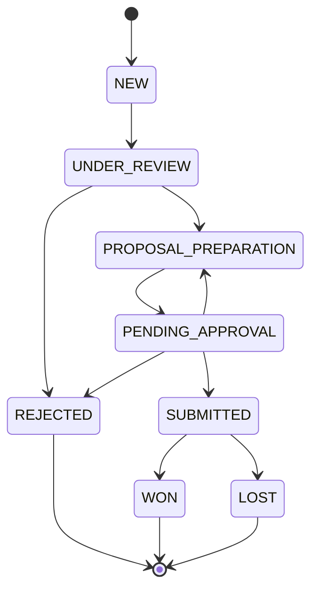
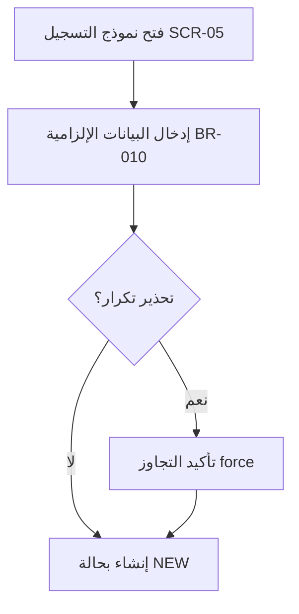

# خطة تنفيذ حزمة توثيق UX/Design لنظام المناقصات

> **للعاملين الوكلاء (agentic workers):** المهارة الفرعية المطلوبة: استخدم superpowers:subagent-driven-development (مُوصى بها) أو superpowers:executing-plans لتنفيذ هذه الخطة مهمةً مهمةً. تستخدم الخطوات صيغة مربّع الاختيار (`- [ ]`) للتتبّع.

**الهدف:** تأليف الدفعة الأولى من 4 وثائق تصميم مؤسَّسة على الواقع لنظام إدارة المناقصات الذكي (Smart Tender Management System)، بحيث تربط كل شاشة بدور وحالة وقاعدة عمل وإجراء عبر معرّفات تتبُّع مشتركة (traceability IDs).

**المعمارية:** أربع وثائق Markdown ضمن `docs/design/`، بالإضافة إلى فهرس README. كل وثيقة مؤسَّسة على الكود الحالي (مخطّط Prisma، وسيط RBAC، مسار tenders، التسميات العربية) وعلى برومبت المشروع. تتقاطع الوثائق مرجعيًّا عبر معرّفات ثابتة (`BR/ACT/SCR/JRN`). تستخدم المخططات Mermaid. المحتوى بالعربية باتجاه RTL؛ وتبقى المعرّفات التقنية بالإنجليزية كما هي في الكود.

**حزمة التقنيات:** Markdown، وMermaid (مخططات الحالة + مخططات التدفّق)، وجداول GitHub-flavored.

## القيود العامة

- الموقع: جميع المخرجات تحت `docs/design/`. (وثيقة المواصفات موجودة مسبقًا في `docs/superpowers/specs/2026-07-21-tender-design-docs-design.md`.)
- اللغة: المحتوى بالعربية، باتجاه RTL. المعرّفات التقنية بالإنجليزية تمامًا كما في الكود: `PROPOSAL_PREPARATION`، `BR-004`، `requireRole`.
- تسميات الأدوار — استخدمها حرفيًّا من `apps/web/src/lib/labels.ts`: ADMIN=مسؤول النظام، QA=مراجع الجودة، WRITER=كاتب العروض، MANAGER=المدير، OWNER=المالك.
- تسميات الحالات — استخدمها حرفيًّا من `labels.ts`: NEW=جديدة، UNDER_REVIEW=قيد المراجعة، REJECTED=مستبعدة، PROPOSAL_PREPARATION=إعداد العرض، PENDING_APPROVAL=بانتظار الاعتماد، SUBMITTED=مقدَّمة، WON=فوز، LOST=خسارة.
- كل عنصر يُوسَم بـ `✅ منفّذ` أو `🔷 مخطّط` حسب الكود الحالي (M0–M2 منفّذة؛ انتقالات آلة الحالة M3 وما بعدها مخطّطة).
- مصدر قواعد العمل: `CLAUDE_CODE_PROMPT_Tender_System.md` — BR-001، BR-002، BR-003، BR-004، BR-005، BR-008، BR-010، BR-011 (ملاحظة: يجب أن يذكر الكتالوج أن BR-006/007/009 غير مُعرَّفة في البرومبت).
- حقائق منفّذة (لا تتعارض معها): `POST /tenders` يتطلّب QA فقط؛ `PATCH /tenders/:id` يتطلّب QA/MANAGER/ADMIN؛ GET للقائمة/التفاصيل يتطلّب مصادقة (أي دور)؛ فحص التكرار على url أو (title+entity)، قابل للتجاوز عبر `?force=1`؛ الإنشاء يضبط status=NEW وcurrentAssignee=المُنشئ؛ نقاط نهاية انتقال الحالة غير موجودة بعد.
- كل كتلة Mermaid يجب أن تكون صحيحة وتُصيَّر دون أخطاء صياغة.

---

### المهمة 1: فهرس الحزمة + كتالوج قواعد العمل

**الملفات:**

- إنشاء: `docs/design/README.md`
- إنشاء: `docs/design/01-business-rules-catalogue.md`

**الواجهات:**

- تُنتِج: كتالوج `BR-xxx` المرجعي مع وسم حالة لكل قاعدة؛ وجدول انتقال الحالات (من→إلى، الدور المسؤول، القاعدة، الحالة) الذي تشير إليه المهمتان 2 و3؛ ومخطط آلة الحالة بصيغة Mermaid. كما تُنتِج فهرس `docs/design/README.md` الذي يسرد الوثائق الأربع جميعها (تُدرَج ملفات المهمتين 3 و4 كمخطَّطة حتى إنشائها).

- [ ] **الخطوة 1: كتابة كتالوج قواعد العمل**

أنشئ `docs/design/01-business-rules-catalogue.md` بالعربية RTL، متضمِّنًا:

1. فقرة تمهيدية: الغرض، والمصدر (`CLAUDE_CODE_PROMPT_Tender_System.md`)، واصطلاح الوسم ✅/🔷.
2. **جدول قواعد العمل** بالأعمدة: `المعرّف | الوصف | أين تُنفَّذ | الإجراءات المرتبطة | الحالة`. صفوف لـ BR-001، BR-002، BR-003، BR-004، BR-005، BR-008، BR-010، BR-011. المحتوى لكل قاعدة:
   - BR-001: لا تحويل لإعداد العرض قبل اكتمال الـChecklist — backend transition guard — ACT-04/ACT-05 — 🔷 مخطّط.
   - BR-002: سبب الرفض إلزامي — backend — ACT-06 — 🔷 مخطّط.
   - BR-003: مسؤول واحد فقط لكل مناقصة — حقل `currentAssigneeId` — ACT-05/ACT-09 — ✅ منفّذ (الحقل موجود؛ يُضبط عند الإنشاء).
   - BR-004: لا تقديم بدون اعتماد المدير — حقل `managerApprovedAt` — ACT-07/ACT-08/ACT-10 — 🔷 مخطّط.
   - BR-005: لا تُغلق مناقصة مُقدَّمة بدون نتيجة — backend — ACT-11 — 🔷 مخطّط.
   - BR-008: كل إجراء جوهري يُسجَّل في Audit Log — `logAudit()` في `lib/audit.ts` — كل الإجراءات — ✅ منفّذ (للإنشاء والتعديل).
   - BR-010: موعد الإغلاق والجهة المعلنة إلزاميان — `closingDate`/`entity` NOT NULL — ACT-01 — ✅ منفّذ.
   - BR-011: إعادة العرض تتطلب ملاحظات إلزامية — backend — ACT-09 — 🔷 مخطّط.
3. سطر ملاحظة: "BR-006, BR-007, BR-009 غير مُعرَّفة في البرومبت الحالي — محجوزة."
4. **مخطط انتقال الحالات** — بصيغة Mermaid `stateDiagram-v2`:



5. **جدول الانتقالات** بالأعمدة: `من | إلى | الدور المسؤول | القاعدة | الحالة`. صفٌّ واحد لكل حافة أعلاه:
   - NEW→UNDER_REVIEW — QA — — 🔷
   - UNDER_REVIEW→PROPOSAL_PREPARATION — QA — BR-001 — 🔷
   - UNDER_REVIEW→REJECTED — QA — BR-002 — 🔷
   - PROPOSAL_PREPARATION→PENDING_APPROVAL — WRITER — BR-004 — 🔷
   - PENDING_APPROVAL→SUBMITTED — MANAGER — BR-004 — 🔷
   - PENDING_APPROVAL→PROPOSAL_PREPARATION — MANAGER — BR-011 — 🔷
   - PENDING_APPROVAL→REJECTED — MANAGER — BR-002 — 🔷
   - SUBMITTED→WON — MANAGER — BR-005 — 🔷
   - SUBMITTED→LOST — MANAGER — BR-005 — 🔷
6. **جدول القرار** — القبول/الرفض/الإعادة: بالأعمدة `الشرط | القرار | القاعدة`. الصفوف: Checklist مكتمل→تحويل لإعداد العرض (BR-001)؛ Checklist ناقص→يبقى قيد المراجعة (BR-001)؛ طلب ناقص بيانات→رفض بسبب (BR-002)؛ عرض يحتاج تعديل→إعادة للكاتب بملاحظات (BR-011)؛ اعتماد المدير موجود→يسمح بالتقديم (BR-004).

- [ ] **الخطوة 2: كتابة فهرس الحزمة**

أنشئ `docs/design/README.md` بالعربية RTL: العنوان "حزمة توثيق UX/Design — نظام المناقصات"، وسطر غرض واحد، واصطلاح ✅/🔷، وجدول بالوثائق الأربع مع روابط: `01-business-rules-catalogue.md` (✅ مكتمل)، `02-roles-permissions-matrix.md`، `03-user-journeys.md`، `04-screen-inventory-and-specs.md`. أضِف قسم "المعرّفات المشتركة" يُعرِّف بإيجاز البادئات BR/ACT/SCR/JRN. أشِر إلى مصدر المواصفات في `docs/superpowers/specs/2026-07-21-tender-design-docs-design.md`.

- [ ] **الخطوة 3: التحقّق من التسميات والمعرّفات وMermaid**

نفِّذ: `grep -oE "BR-0[0-9]{2}" docs/design/01-business-rules-catalogue.md | sort -u`
المتوقَّع: بالضبط BR-001، BR-002، BR-003، BR-004، BR-005، BR-008، BR-010، BR-011.

نفِّذ: `grep -c "جديدة\|قيد المراجعة\|إعداد العرض\|بانتظار الاعتماد\|مقدَّمة" docs/design/01-business-rules-catalogue.md`
المتوقَّع: قيمة غير صفرية (تسميات الحالات العربية موجودة).

تأكّد يدويًّا أن كتلة Mermaid تفتح بـ ` ```mermaid ` وتُغلق بـ ` ``` `، وأن كل اسم حالة يطابق تعداد `TenderStatus` تمامًا.

- [ ] **الخطوة 4: الالتزام (Commit)**

```bash
git add docs/design/README.md docs/design/01-business-rules-catalogue.md
git commit -m "docs(design): add business rules catalogue + package index"
```

---

### المهمة 2: مصفوفة الأدوار والصلاحيات

**الملفات:**

- إنشاء: `docs/design/02-roles-permissions-matrix.md`

**الواجهات:**

- تستهلك: `BR-xxx` وجدول الانتقالات من المهمة 1 (`01-business-rules-catalogue.md`).
- تُنتِج: كتالوج الإجراءات المرجعي `ACT-01…ACT-13` الذي تشير إليه المهمتان 3 و4 عبر المعرّف.

- [ ] **الخطوة 1: كتابة مصفوفة الأدوار والصلاحيات**

أنشئ `docs/design/02-roles-permissions-matrix.md` بالعربية RTL:

1. تمهيد: الغرض، وأن تسميات/صلاحيات الأدوار مؤسَّسة على `apps/api/src/middleware/auth.ts` و`apps/api/src/routes/*`.
2. **جدول كتالوج الإجراءات** `المعرّف | الإجراء | القاعدة | الحالة` — ACT-01..ACT-13 تمامًا كما في المواصفات §4.1:
   - ACT-01 تسجيل مناقصة / BR-010 / ✅ (QA)
   - ACT-02 تعديل بيانات المناقصة / — / ✅ (QA/MANAGER/ADMIN)
   - ACT-03 عرض قائمة/تفاصيل / — / ✅ (الكل)
   - ACT-04 تطبيق/تحديث الـChecklist / BR-001 / 🔷
   - ACT-05 تحويل لإعداد العرض / BR-001 / 🔷
   - ACT-06 استبعاد/رفض (بسبب) / BR-002 / 🔷
   - ACT-07 إرسال للاعتماد / BR-004 / 🔷
   - ACT-08 اعتماد العرض / BR-004 / 🔷
   - ACT-09 إعادة للكاتب (بملاحظات) / BR-011 / 🔷
   - ACT-10 تسجيل التقديم / BR-004 / 🔷
   - ACT-11 تسجيل النتيجة (Won/Lost) / BR-005 / 🔷
   - ACT-12 إدارة المستخدمين والأدوار / — / ✅ (ADMIN)
   - ACT-13 رفع/إدارة المرفقات / — / 🔷
3. **مصفوفة الصلاحيات** — الصفوف = ACT-01..ACT-13، الأعمدة = QA، WRITER، MANAGER، OWNER، ADMIN، الخلايا = نعم / لا / محدود. اتبع مسؤوليات الأدوار من البرومبت: QA→ACT-01/02/03/04/05/06؛ WRITER→ACT-03/07/13؛ MANAGER→ACT-02/03/08/09/10/11؛ OWNER→ACT-03 (قراءة فقط) نعم والباقي لا؛ ADMIN→ACT-02/03/12 (لا يشارك في سير عمل المناقصة). كل خلية OWNER عدا ACT-03 = لا.
4. **انتقالات الحالة حسب الدور** — أعِد صياغة انتقالات المهمة 1 مجمَّعةً حسب الدور المسؤول (QA / WRITER / MANAGER).
5. **ملاحظات التنفيذ (فجوات RBAC):** جدول `الإجراء | ما يفرضه الكود حاليًا | المطلوب`. يتضمّن: ACT-01 → `requireRole('QA')` ✅ مطابق؛ ACT-02 → `requireRole('QA','MANAGER','ADMIN')` — ملاحظة: الكود يسمح بالتعديل في أي حالة بلا قيد حالة؛ المطلوب لاحقًا تقييده؛ ACT-04..ACT-11 → لا تُوجد endpoints بعد (🔷).

- [ ] **الخطوة 2: التحقّق من معرّفات الإجراءات وتغطية الأدوار**

نفِّذ: `grep -oE "ACT-[0-9]{2}" docs/design/02-roles-permissions-matrix.md | sort -u`
المتوقَّع: من ACT-01 إلى ACT-13، بلا فجوات.

نفِّذ: `grep -c "مراجع الجودة\|كاتب العروض\|المدير\|المالك\|مسؤول النظام" docs/design/02-roles-permissions-matrix.md`
المتوقَّع: قيمة غير صفرية (تسميات الأدوار الخمس جميعها موجودة).

- [ ] **الخطوة 3: الالتزام (Commit)**

```bash
git add docs/design/02-roles-permissions-matrix.md
git commit -m "docs(design): add roles & permissions matrix with RBAC gaps"
```

---

### المهمة 3: رحلات المستخدم

**الملفات:**

- إنشاء: `docs/design/03-user-journeys.md`

**الواجهات:**

- تستهلك: `BR-xxx` + الانتقالات (المهمة 1)، و`ACT-xx` (المهمة 2). تشير إلى `SCR-xx` عبر المعرّف (المُعرَّف في المهمة 4) — اسرد معرّفات SCR المستخدَمة هنا كي تغطّيها المهمة 4: SCR-01 تسجيل الدخول، SCR-02 الرئيسية/لوحة المعلومات، SCR-03 قائمة المناقصات، SCR-04 تفاصيل المناقصة، SCR-05 نموذج المناقصة، SCR-06 إدارة المستخدمين.
- تُنتِج: معرّفات الرحلات `JRN-01…JRN-07` التي تشير إليها شاشات المهمة 4.

- [ ] **الخطوة 1: كتابة وثيقة رحلات المستخدم**

أنشئ `docs/design/03-user-journeys.md` بالعربية RTL. التمهيد: الغرض + أن كل رحلة تربط الخطوات بالدور والحالة والقاعدة والشاشة ونقطة الفشل. ثم قسمٌ لكل رحلة؛ يحتوي كلٌّ منها على Mermaid `flowchart TD` وجدول خطوات `الخطوة | الدور | الحالة قبل | الحالة بعد | القاعدة | الشاشة | نقطة فشل محتملة`:

- **JRN-01 تسجيل مناقصة** (QA, ACT-01): يفتح نموذج التسجيل (SCR-05) → يدخل البيانات الإلزامية (BR-010) → تحذير تكرار قابل للتجاوز (`force`) → تُنشأ بحالة NEW. فشل: بيانات ناقصة / تجاهل تحذير تكرار.
- **JRN-02 مراجعة QA** (QA, ACT-04/05/06): يفتح التفاصيل (SCR-04) → يطبّق الـChecklist (BR-001) → إما تحويل لإعداد العرض (→PROPOSAL_PREPARATION) أو استبعاد بسبب (BR-002 →REJECTED). فشل: Checklist ناقص يمنع التحويل.
- **JRN-03 إعداد العرض** (WRITER, ACT-13/07): يستلم المناقصة → يرفع المرفقات → يرسل للاعتماد (→PENDING_APPROVAL, BR-004). فشل: إرسال بلا مرفقات مطلوبة.
- **JRN-04 اعتماد المدير** (MANAGER, ACT-08/09): يراجع → يعتمد (→SUBMITTED عبر التقديم) أو يعيد للكاتب بملاحظات (BR-011 →PROPOSAL_PREPARATION). فشل: إعادة بلا ملاحظات.
- **JRN-05 التقديم** (MANAGER, ACT-10): بعد الاعتماد (`managerApprovedAt`, BR-004) → يسجّل التقديم (→SUBMITTED). فشل: تقديم بلا اعتماد.
- **JRN-06 تسجيل النتيجة** (MANAGER, ACT-11): يسجّل Won أو Lost (BR-005 →WON/LOST). فشل: إغلاق بلا نتيجة.
- **JRN-07 متابعة/قراءة** (OWNER, ACT-03): يفتح القوائم والتقارير للقراءة فقط (SCR-02/03/04). فشل: محاولة إجراء غير مسموح → عدم صلاحية.

مثال Mermaid لـ JRN-01 (تحصل كل رحلة على مخطط تدفّق مماثل خاص بها):



- [ ] **الخطوة 2: التحقّق من الإحالات المتقاطعة**

نفِّذ: `grep -oE "JRN-0[0-9]" docs/design/03-user-journeys.md | sort -u`
المتوقَّع: من JRN-01 إلى JRN-07.

نفِّذ: `grep -oE "SCR-0[0-9]" docs/design/03-user-journeys.md | sort -u`
المتوقَّع: مجموعة جزئية من SCR-01..SCR-06 (يجب أن تغطّيها المهمة 4 جميعها).

نفِّذ: `grep -c "mermaid" docs/design/03-user-journeys.md`
المتوقَّع: 7 (مخطط تدفّق واحد لكل رحلة).

- [ ] **الخطوة 3: الالتزام (Commit)**

```bash
git add docs/design/03-user-journeys.md
git commit -m "docs(design): add user journeys mapped to states, rules, screens"
```

---

### المهمة 4: جرد الشاشات ومواصفاتها + تمريرة الاتساق النهائية

**الملفات:**

- إنشاء: `docs/design/04-screen-inventory-and-specs.md`
- تعديل: `docs/design/README.md` (وسم الوثائق الأربع جميعها كمكتملة)

**الواجهات:**

- تستهلك: `SCR-01..SCR-06` (المُشار إليها في المهمة 3)، والأدوار (المهمة 2)، والحالات (المهمة 1)، و`JRN-xx` (المهمة 3).

- [ ] **الخطوة 1: كتابة جرد الشاشات ومواصفاتها**

أنشئ `docs/design/04-screen-inventory-and-specs.md` بالعربية RTL. تمهيد + **جدول جرد الشاشات** `المعرّف | الشاشة | الملف | من يراها | الحالة`، مؤسَّس على `apps/web/src/pages/*`:

- SCR-01 تسجيل الدخول — `LoginPage.tsx` — الكل — ✅
- SCR-02 الرئيسية/لوحة المعلومات — `HomePage.tsx` — الكل حسب الدور — ✅
- SCR-03 قائمة المناقصات — `TendersPage.tsx` — الكل — ✅
- SCR-04 تفاصيل المناقصة — `TenderDetailsPage.tsx` — الكل — ✅
- SCR-05 نموذج المناقصة — `TenderFormPage.tsx` — QA — ✅
- SCR-06 إدارة المستخدمين — `AdminUsersPage.tsx` — ADMIN — ✅

ثم **قسم مواصفات فرعي لكل شاشة** يتضمّن: الهدف؛ من يراها (الأدوار)؛ الحقول (الإلزامي منها)؛ الرحلات المرتبطة (`JRN-xx`)؛ و**جدول الحالات** `الحالة | السلوك` يغطّي بالضبط: فارغ، تحميل، نجاح، خطأ، عدم صلاحية، انتهاء الجلسة. أسِّس قوائم الحقول على الكود الفعلي: حقول SCR-05 = title، entity، closingDate (إلزامي BR-010)، source، url، description؛ تعرض SCR-04 currentAssignee + statusHistory + checklist + attachments؛ تحتوي SCR-03 على مرشِّحات (status، entity، assignee، closing date، q) + ترقيم صفحات + فرز حسب closingDate. لعدم الصلاحية استخدم الرسالة الفعلية "ليست لديك صلاحية لهذا الإجراء"؛ ولانتهاء الجلسة استخدم "جلسة غير صالحة، سجّل الدخول مجددًا".

- [ ] **الخطوة 2: تحديث الفهرس**

عدِّل `docs/design/README.md`: وسم الوثائق الأربع جميعها بـ ✅ مكتمل في جدول الوثائق.

- [ ] **الخطوة 3: التحقّق من الاتساق عبر الوثائق**

نفِّذ: `grep -oE "SCR-0[0-9]" docs/design/03-user-journeys.md docs/design/04-screen-inventory-and-specs.md | grep -oE "SCR-0[0-9]" | sort -u`
المتوقَّع: كل معرّف SCR مستخدَم في المهمة 3 يظهر في المهمة 4.

نفِّذ: `grep -rho "ACT-[0-9][0-9]" docs/design/ | sort -u | wc -l`
المتوقَّع: 13 (ACT-01..ACT-13 جميعها مُشار إليها في مكان ما).

نفِّذ: `grep -rl "قيد الدراسة\|تحت المراجعة\|تحت الاعتماد" docs/design/`
المتوقَّع: لا مُخرَجات (لا مرادفات حالة خارج المواصفات — تُستخدم فقط التسميات من `labels.ts`).

- [ ] **الخطوة 4: الالتزام (Commit)**

```bash
git add docs/design/04-screen-inventory-and-specs.md docs/design/README.md
git commit -m "docs(design): add screen inventory & specs, complete package"
```

---

## المراجعة الذاتية

**تغطية المواصفات:** §5.1 → المهمة 1؛ §5.2 → المهمة 2؛ §5.3 → المهمة 3؛ §5.4 → المهمة 4؛ §6 ترتيب الإنتاج → ترتيب المهام (1→4)؛ §2 فهرس README → المهمة 1 الخطوة 2 + المهمة 4 الخطوة 2؛ §7 معايير القبول → خطوات التحقّق في كل مهمة (التسميات، تفرُّد المعرّفات، الوسم ✅/🔷، صحّة Mermaid، عدم وجود تعارضات). كل ذلك مُغطّى.

**فحص العناصر النائبة (Placeholder scan):** لا TBD/TODO. محتوى كل وثيقة مُعدَّد بصفوف ومعرّفات وتسميات عربية محدّدة. أمثلة Mermaid كاملة وصحيحة.

**اتساق الأنواع/المعرّفات:** مجموعة BR = {001,002,003,004,005,008,010,011} متسقة عبر المهام 1–2. ACT-01..ACT-13 مُعرَّفة في المهمة 2، ومُشار إليها في المهام 1/3/4. SCR-01..SCR-06 مُشار إليها في المهمة 3، ومُعرَّفة في المهمة 4 (مُتحقَّق منها في الخطوة 3). JRN-01..JRN-07 مُعرَّفة في المهمة 3، ومُشار إليها في المهمة 4. تسميات الأدوار/الحالات مثبَّتة على `labels.ts` في القيود العامة.
