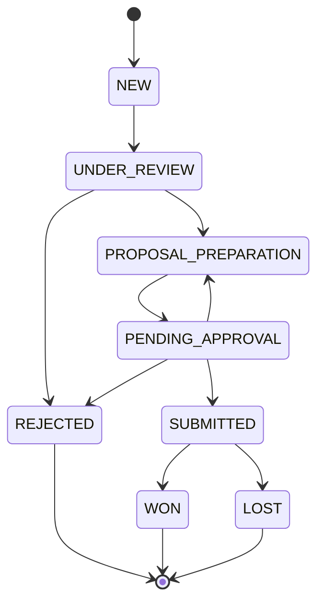

# 01 — كتالوج قواعد العمل (Business Rules Catalogue)

## الغرض والمصدر

هذا المستند هو الكتالوج المرجعي لقواعد العمل (Business Rules) في نظام إدارة المناقصات. المصدر الأساسي لهذه القواعد هو ملف `CLAUDE_CODE_PROMPT_Tender_System.md` (قسم قواعد العمل، البحث عن "BR-00"). كل قاعدة هنا موسومة بحالة تنفيذ:

- ✅ **منفّذ**: القاعدة مطبَّقة فعليًا في الكود الحالي (Backend/DB) اعتبارًا من نهاية M6 (الإشعارات).
- 🔷 **مخطّط**: القاعدة موثّقة كمتطلب لكنها لم تُنفَّذ بعد في الكود؛ تنفيذها متوقّع في مراحل لاحقة من خارطة الطريق.

> **تحديث M3 + M4:** أُنجزت مرحلتا المراجعة والـChecklist (M3) وسير العمل الكامل (M4). كل انتقالات الحالة تمر الآن حصريًا عبر **State Machine مركزية** في `apps/api/src/services/tenderWorkflow.ts` (جدول انتقالات واحد: من → إلى → الأدوار المسموح لها)، ويُنفَّذ تغيير الحالة عبر `recordStatusChange()` في `apps/api/src/lib/statusChange.ts` (يحدّث الحالة + `TenderStatusHistory` + Audit في معاملة واحدة). نتيجةً لذلك انتقلت القواعد BR-001/002/004/005/011 من "مخطّط" إلى "منفّذ".

> **تحديث M6 (الإشعارات):** أصبحت BR-009 **منفّذة** — job مجدول عبر node-cron (`services/closingReminder.ts`، مُجدوَل في `src/index.ts`) ينشئ إشعار `CLOSING_SOON` للمناقصات النشطة التي يقترب موعد إغلاقها خلال عدد أيام قابل للتعديل من `SystemSetting` (`closingReminderDays`، افتراضيًا 3)، دون تكرار الإشعار لنفس المناقصة. كما أُضيف `NotificationService` يُنشئ إشعارات عند ستة أحداث سير عمل (إنشاء/تعيين/إرسال للاعتماد/إعادة/اعتماد/نتيجة). المرفقات (M5) موثّقة في ACT-13 بمصفوفة الأدوار وSCR-04.

## جدول قواعد العمل

| المعرّف | الوصف | أين تُنفَّذ | الإجراءات المرتبطة | الحالة |
|---|---|---|---|---|
| BR-001 | لا تحويل لإعداد العرض قبل اكتمال الـChecklist | ضابط `isChecklistComplete()` في `routes/tenders.ts` (يُفرَض في التعيين ACT-05 واعتماد المراجعة) | ACT-04 / ACT-05 | ✅ منفّذ |
| BR-002 | سبب الرفض إلزامي | `reviewDecisionSchema` (استبعاد QA) و`managerDecisionSchema` (إيقاف المدير) في `packages/shared` | ACT-06 | ✅ منفّذ |
| BR-003 | مسؤول واحد فقط لكل مناقصة | حقل `currentAssigneeId` يُضبط عند كل انتقال (تعيين الكاتب، الإعادة، إلخ) | ACT-05 / ACT-09 | ✅ منفّذ |
| BR-004 | لا تقديم بدون اعتماد المدير | حقل `managerApprovedAt`؛ `mark-submitted` يرفض 422 إن كان فارغًا | ACT-07 / ACT-08 / ACT-10 | ✅ منفّذ |
| BR-005 | لا تُغلق مناقصة مُقدَّمة بدون نتيجة | `result` لا يُقبل إلا من `SUBMITTED` (State Machine) → WON/LOST | ACT-11 | ✅ منفّذ |
| BR-008 | كل إجراء جوهري يُسجَّل في Audit Log | `logAudit()` في `lib/audit.ts`، يُستدعى من كل انتقالات سير العمل عبر `recordStatusChange()` | كل الإجراءات | ✅ منفّذ (إنشاء/تعديل + كل انتقالات M3/M4) |
| BR-009 | تنبيه اقتراب موعد الإغلاق قبل الموعد بعدد أيام قابل للتعديل، لكل المناقصات النشطة، بدون تكرار الإشعار لنفس المناقصة | `services/closingReminder.ts` (`runClosingReminders`) + جدولة node-cron في `src/index.ts` + قيمة `closingReminderDays` في `SystemSetting` | — (إشعار نظام مجدول، ليس إجراء مستخدم) | ✅ منفّذ (M6.2) |
| BR-010 | موعد الإغلاق والجهة المعلنة إلزاميان | `closingDate` / `entity` NOT NULL | ACT-01 | ✅ منفّذ |
| BR-011 | إعادة العرض تتطلب ملاحظات إلزامية | `managerDecisionSchema` (فرع `return` يتطلب `notes`) | ACT-09 | ✅ منفّذ |

> **ملاحظة:** BR-006, BR-007 غير مُعرَّفتين في البرومبت الحالي — محجوزتان.

## مخطط انتقال الحالات (State Transition Diagram)

أسماء الحالات أدناه مطابقة تمامًا لتعداد `TenderStatus` في `apps/api/prisma/schema.prisma`.

مقابلة الحالات بالعربية (حسب `apps/web/src/lib/labels.ts`):

| الحالة (Enum) | التسمية بالعربية |
|---|---|
| NEW | جديدة |
| UNDER_REVIEW | قيد المراجعة |
| REJECTED | مستبعدة |
| PROPOSAL_PREPARATION | إعداد العرض |
| PENDING_APPROVAL | بانتظار الاعتماد |
| SUBMITTED | مقدَّمة |
| WON | فوز |
| LOST | خسارة |

## جدول الانتقالات (Transitions Table)

هذا الجدول مطابق حرفيًا لثابت `TRANSITIONS` في `apps/api/src/services/tenderWorkflow.ts` (المصدر الوحيد لقواعد تغيير الحالة). عمود "الإجراء (action)" هو اسم الانتقال في الـState Machine.

| من | إلى | الإجراء (action) | الدور المسؤول | القاعدة | الحالة |
|---|---|---|---|---|---|
| NEW | UNDER_REVIEW | `REVIEW_START` | QA | — | ✅ |
| UNDER_REVIEW | REJECTED | `REVIEW_REJECT` | QA | BR-002 | ✅ |
| UNDER_REVIEW | PROPOSAL_PREPARATION | `ASSIGN_WRITER` | QA | BR-001 / BR-003 | ✅ |
| PROPOSAL_PREPARATION | PENDING_APPROVAL | `SUBMIT_FOR_APPROVAL` | WRITER (المعيّن فقط) | — | ✅ |
| PENDING_APPROVAL | PROPOSAL_PREPARATION | `MANAGER_RETURN` | MANAGER | BR-011 | ✅ |
| PENDING_APPROVAL | REJECTED | `MANAGER_STOP` | MANAGER | BR-002 | ✅ |
| PENDING_APPROVAL | SUBMITTED | `MARK_SUBMITTED` | MANAGER | BR-004 | ✅ |
| SUBMITTED | WON | `RESULT_WON` | MANAGER | BR-005 | ✅ |
| SUBMITTED | LOST | `RESULT_LOST` | MANAGER | BR-005 | ✅ |

> **ملاحظة:** اعتماد المدير (`ACT-08`) ليس انتقال حالة — يضبط الحقل `managerApprovedAt` وتبقى الحالة `PENDING_APPROVAL` (استعدادًا لـ`MARK_SUBMITTED` وفق BR-004). أي محاولة انتقال غير موجود في الجدول أعلاه ترفضها الـState Machine بـ`422 INVALID_TRANSITION`، وأي انتقال بدور غير مسموح يُرفض بـ`403 FORBIDDEN_TRANSITION`.

## جدول القرارات (Decision Table) — القبول / الرفض / الإعادة

| الشرط | القرار | القاعدة |
|---|---|---|
| Checklist مكتمل | تحويل لإعداد العرض | BR-001 |
| Checklist ناقص | يبقى قيد المراجعة | BR-001 |
| طلب ناقص بيانات | رفض بسبب | BR-002 |
| عرض يحتاج تعديل | إعادة للكاتب بملاحظات | BR-011 |
| اعتماد المدير موجود | يسمح بالتقديم | BR-004 |

