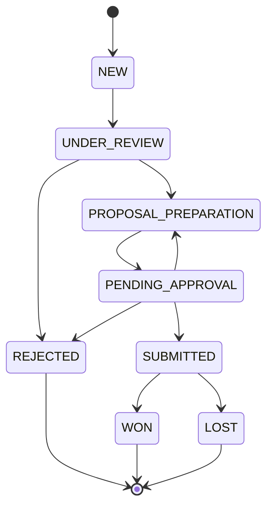

# كتالوج قواعد العمل

## مقدّمة

هذا الكتالوج يُعرِّف جميع قواعد العمل الأساسية التي تحكم نظام إدارة المناقصات الذكي. كل قاعدة معرّفة برقم فريد (BR-xxx)، وترتبط بالإجراءات والحالات عبر معرّفات مشتركة.

**المصدر:** `CLAUDE_CODE_PROMPT_Tender_System.md`  
**الاصطلاح:**
- ✅ منفّذ: مُطبّق بالفعل في الكود الحالي
- 🔷 مخطّط: قيد التطوير أو التخطيط

---

## جدول قواعد العمل

| المعرّف | الوصف | أين تُنفَّذ | الإجراءات المرتبطة | الحالة |
|---------|--------|-----------|------------------|--------|
| BR-001 | لا تحويل إلى "إعداد العرض" قبل اكتمال الـ Checklist | Backend transition guard | ACT-04, ACT-05 | 🔷 مخطّط |
| BR-002 | سبب الرفض إلزامي عند استبعاد مناقصة | Backend validation | ACT-06 | 🔷 مخطّط |
| BR-003 | مسؤول واحد فقط لكل مناقصة (currentAssigneeId) | حقل في قاعدة البيانات | ACT-05, ACT-09 | ✅ منفّذ |
| BR-004 | لا تقديم بدون اعتماد المدير (managerApprovedAt) | Backend guard | ACT-07, ACT-08, ACT-10 | 🔷 مخطّط |
| BR-005 | لا إغلاق مناقصة مُقدَّمة بدون تسجيل نتيجة (Won/Lost) | Backend guard | ACT-11 | 🔷 مخطّط |
| BR-008 | كل إجراء جوهري يُسجَّل في Audit Log | logAudit() في lib/audit.ts | كل الإجراءات | ✅ منفّذ |
| BR-010 | موعد الإغلاق والجهة المعلنة إلزاميان (closingDate, entity) | قيود NOT NULL | ACT-01 | ✅ منفّذ |
| BR-011 | إعادة العرض تتطلب ملاحظات إلزامية من المدير | Backend validation | ACT-09 | 🔷 مخطّط |

### ملاحظة
**BR-006, BR-007, BR-009** غير مُعرَّفة في البرومبت الحالي — محجوزة للتوسع المستقبلي.

---

## مخطط انتقال الحالات

**شرح الحالات:**
- **NEW** (جديدة): مناقصة مُسجَّلة للتو
- **UNDER_REVIEW** (قيد المراجعة): قيد التدقيق من قبل مراجع الجودة
- **PROPOSAL_PREPARATION** (إعداد العرض): الكاتب يُحضّر العرض
- **PENDING_APPROVAL** (بانتظار الاعتماد): العرض مُرسَل للمدير للاعتماد
- **SUBMITTED** (مقدَّمة): العرض مُقدَّم رسميًا
- **REJECTED** (مستبعدة): المناقصة مستبعدة نهائيًا
- **WON** (فوز): فازت المناقصة
- **LOST** (خسارة): خسرت المناقصة

---

## جدول الانتقالات (من → إلى)

| من | إلى | الدور المسؤول | القاعدة | الحالة |
|----|-----|------------|--------|--------|
| NEW | UNDER_REVIEW | مراجع الجودة (QA) | — | 🔷 مخطّط |
| UNDER_REVIEW | PROPOSAL_PREPARATION | مراجع الجودة (QA) | BR-001 | 🔷 مخطّط |
| UNDER_REVIEW | REJECTED | مراجع الجودة (QA) | BR-002 | 🔷 مخطّط |
| PROPOSAL_PREPARATION | PENDING_APPROVAL | كاتب العروض (WRITER) | BR-004 | 🔷 مخطّط |
| PENDING_APPROVAL | SUBMITTED | المدير (MANAGER) | BR-004 | 🔷 مخطّط |
| PENDING_APPROVAL | PROPOSAL_PREPARATION | المدير (MANAGER) | BR-011 | 🔷 مخطّط |
| PENDING_APPROVAL | REJECTED | المدير (MANAGER) | BR-002 | 🔷 مخطّط |
| SUBMITTED | WON | المدير (MANAGER) | BR-005 | 🔷 مخطّط |
| SUBMITTED | LOST | المدير (MANAGER) | BR-005 | 🔷 مخطّط |

---

## جدول القرار (منطق الانتقال)

| الشرط | القرار | القاعدة |
|------|--------|--------|
| Checklist مكتمل ✅ | تحويل إلى "إعداد العرض" | BR-001 |
| Checklist ناقص ❌ | يبقى قيد المراجعة | BR-001 |
| طلب ناقص بيانات | رفض مع سبب إلزامي | BR-002 |
| عرض يحتاج تعديل | إعادة للكاتب بملاحظات | BR-011 |
| اعتماد المدير موجود ✅ | السماح بالتقديم | BR-004 |
| عرض مُقدَّم + Win/Loss | تسجيل النتيجة | BR-005 |

---

## ملخص التنفيذ

### المُنجَز (M0–M2) ✅
- حقول قاعدة البيانات: `currentAssigneeId`, `closingDate`, `entity`, `status`
- Audit logging للإنشاء والتعديل
- قيود NOT NULL على الحقول الإلزامية

### المُخطَّط (M3+) 🔷
- Endpoints لانتقالات الحالة
- Validation guards في Backend
- Checklist completion logic
- Manager approval workflow

---

**آخر تحديث:** 2026-07-21