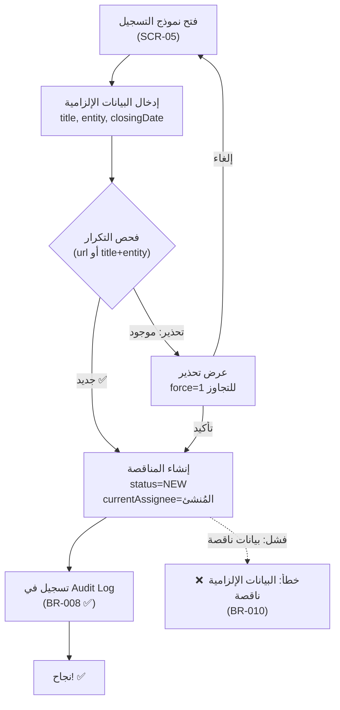
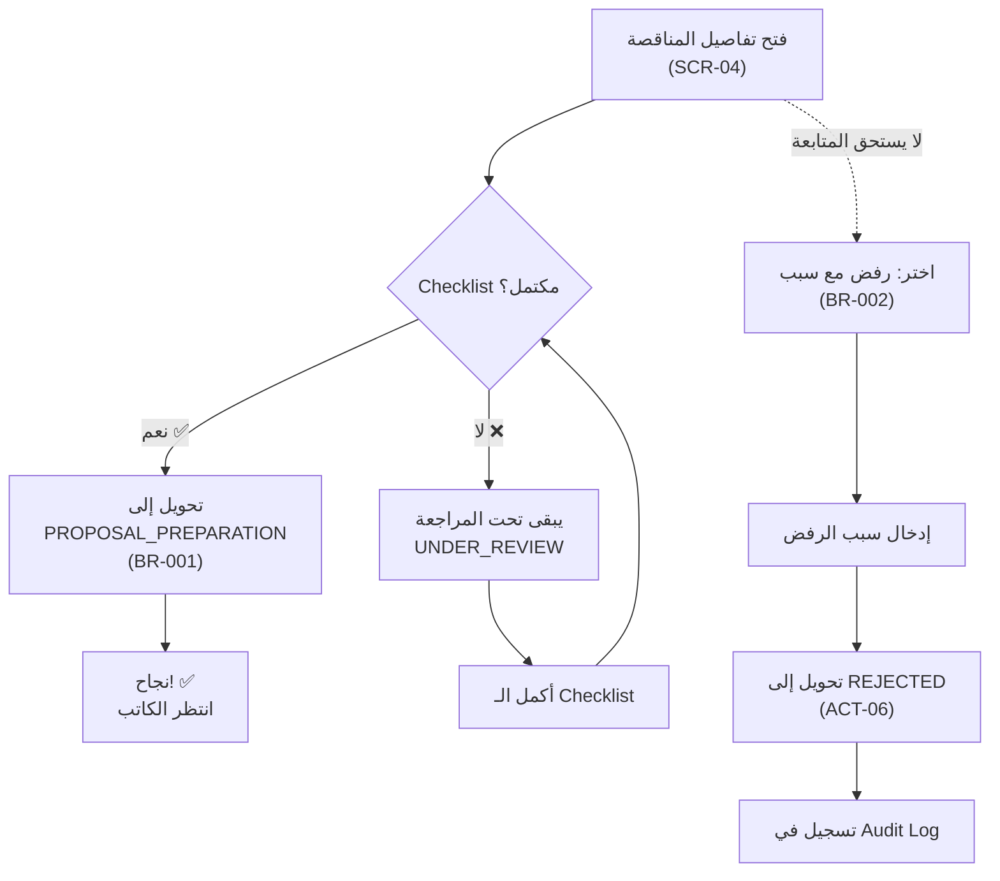
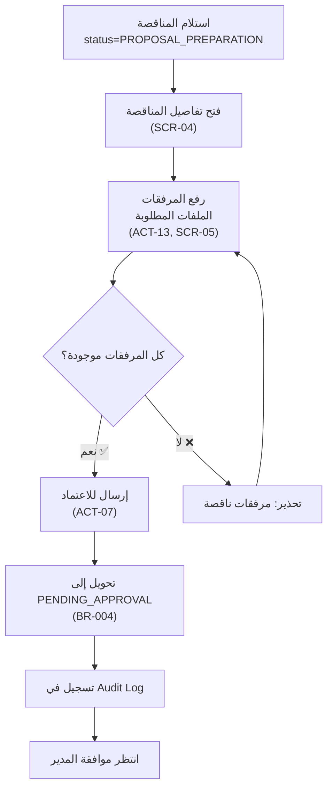
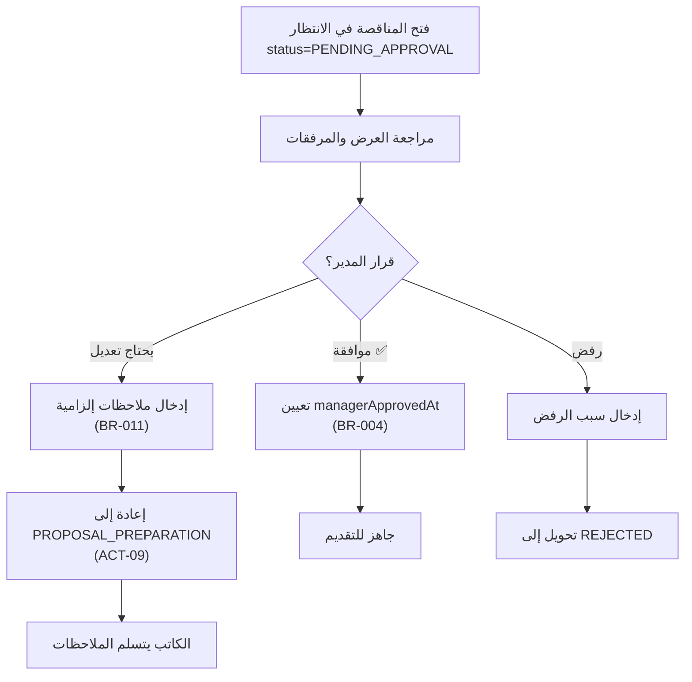
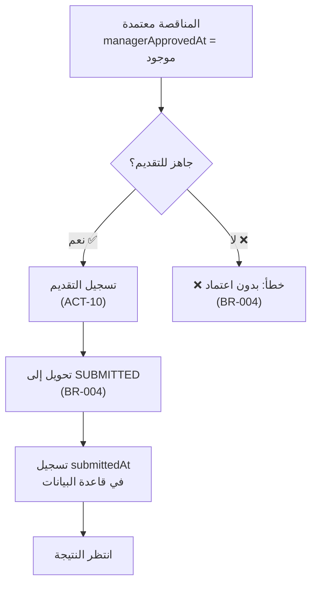
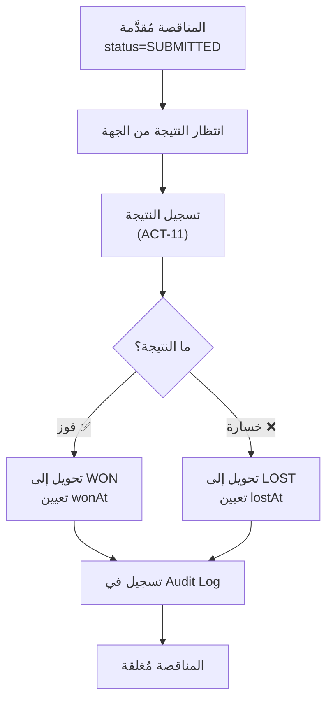
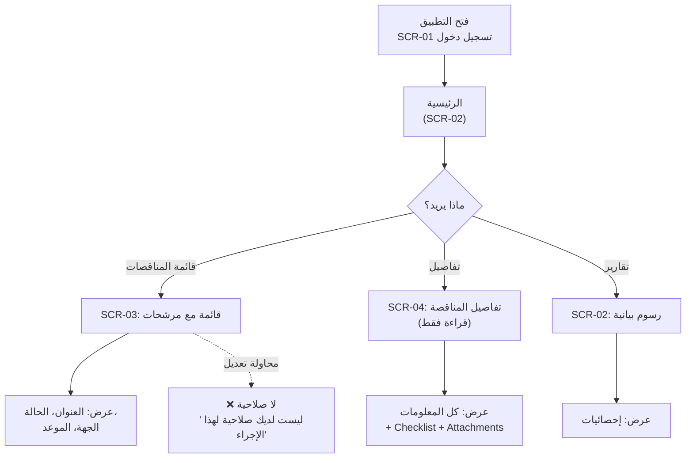

# رحلات المستخدم

## مقدّمة

توثّق هذه الوثيقة سبع رحلات رئيسية في نظام المناقصات. كل رحلة تتبع خطوات المستخدم من البداية إلى النهاية، مع ربط الأدوار والحالات والقواعد والشاشات ونقاط الفشل.

**الرابط بين المكونات:**
- **الدور**: من له صلاحية تنفيذ الخطوة (من BR/ACT)
- **الحالة**: حالة المناقصة قبل وبعد (من 01-business-rules-catalogue.md)
- **القاعدة**: قاعدة العمل المُطبّقة (BR-xxx)
- **الشاشة**: الواجهة المستخدمة (SCR-xx من 04-screen-inventory-and-specs.md)
- **نقطة فشل**: سيناريوهات الخطأ المحتملة

---

## JRN-01: تسجيل مناقصة جديدة

**الدور:** مراجع الجودة (QA)  
**الإجراء:** ACT-01  
**الشاشة:** SCR-05 (نموذج المناقصة)

### مخطط التدفّق

### جدول الخطوات

| الخطوة | الدور | الحالة قبل | الحالة بعد | القاعدة | الشاشة | نقطة فشل |
|--------|------|-----------|-----------|--------|--------|----------|
| 1 | QA | — | — | — | SCR-05 | فتح النموذج |
| 2 | QA | — | — | BR-010 | SCR-05 | إدخال البيانات: title, entity, closingDate |
| 3 | QA | — | — | — | SCR-05 | فحص التكرار (url أو title+entity) |
| 4 | QA | — | — | — | SCR-05 | إذا كان مكررًا: عرض تحذير أو إلغاء |
| 5 | QA | — | NEW | BR-010, BR-008 | SCR-05 | إنشاء المناقصة + تسجيل Audit |

---

## JRN-02: مراجعة QA والقبول/الرفض

**الدور:** مراجع الجودة (QA)  
**الإجراءات:** ACT-04, ACT-05, ACT-06  
**الشاشة:** SCR-04 (تفاصيل المناقصة)

### مخطط التدفّق

### جدول الخطوات

| الخطوة | الدور | الحالة قبل | الحالة بعد | القاعدة | الشاشة | نقطة فشل |
|--------|------|-----------|-----------|--------|--------|----------|
| 1 | QA | NEW | UNDER_REVIEW | — | SCR-04 | فتح التفاصيل |
| 2 | QA | UNDER_REVIEW | — | BR-001 | SCR-04 | تطبيق/تحديث عناصر Checklist (ACT-04) |
| 3 | QA | UNDER_REVIEW | PROPOSAL_PREPARATION | BR-001 | SCR-04 | تحويل إلى إعداد العرض (ACT-05) — يتطلب Checklist مكتمل |
| 3b | QA | UNDER_REVIEW | REJECTED | BR-002 | SCR-04 | رفض مع إبداء سبب إلزامي (ACT-06) |

---

## JRN-03: إعداد العرض (WRITER)

**الدور:** كاتب العروض (WRITER)  
**الإجراءات:** ACT-13, ACT-07  
**الشاشة:** SCR-04 (تفاصيل)، SCR-05 (النموذج)

### مخطط التدفّق

### جدول الخطوات

| الخطوة | الدور | الحالة قبل | الحالة بعد | القاعدة | الشاشة | نقطة فشل |
|--------|------|-----------|-----------|--------|--------|----------|
| 1 | WRITER | PROPOSAL_PREPARATION | — | — | SCR-04 | استلام المناقصة (الإخطار) |
| 2 | WRITER | PROPOSAL_PREPARATION | — | — | SCR-05 | رفع المرفقات (ACT-13) |
| 3 | WRITER | PROPOSAL_PREPARATION | PENDING_APPROVAL | BR-004 | SCR-04 | إرسال للاعتماد (ACT-07) — يتطلب مرفقات |

---

## JRN-04: اعتماد المدير أو الإعادة

**الدور:** المدير (MANAGER)  
**الإجراءات:** ACT-08, ACT-09  
**الشاشة:** SCR-04 (تفاصيل المناقصة)

### مخطط التدفّق

### جدول الخطوات

| الخطوة | الدور | الحالة قبل | الحالة بعد | القاعدة | الشاشة | نقطة فشل |
|--------|------|-----------|-----------|--------|--------|----------|
| 1 | MANAGER | PENDING_APPROVAL | — | — | SCR-04 | مراجعة العرض |
| 2 | MANAGER | PENDING_APPROVAL | PENDING_APPROVAL | BR-004 | SCR-04 | اعتماد العرض + تعيين managerApprovedAt (ACT-08) |
| 2b | MANAGER | PENDING_APPROVAL | PROPOSAL_PREPARATION | BR-011 | SCR-04 | إعادة بملاحظات إلزامية (ACT-09) |
| 2c | MANAGER | PENDING_APPROVAL | REJECTED | BR-002 | SCR-04 | رفض نهائي بسبب |

---

## JRN-05: تقديم العرض رسميًا

**الدور:** المدير (MANAGER)  
**الإجراء:** ACT-10  
**الشاشة:** SCR-04 (تفاصيل المناقصة)

### مخطط التدفّق

### جدول الخطوات

| الخطوة | الدور | الحالة قبل | الحالة بعد | القاعدة | الشاشة | نقطة فشل |
|--------|------|-----------|-----------|--------|--------|----------|
| 1 | MANAGER | PENDING_APPROVAL | — | BR-004 | SCR-04 | التحقق من وجود managerApprovedAt |
| 2 | MANAGER | PENDING_APPROVAL | SUBMITTED | BR-004 | SCR-04 | تسجيل التقديم (ACT-10) + تعيين submittedAt |

---

## JRN-06: تسجيل النتيجة (فوز/خسارة)

**الدور:** المدير (MANAGER)  
**الإجراء:** ACT-11  
**الشاشة:** SCR-04 (تفاصيل المناقصة)

### مخطط التدفّق

### جدول الخطوات

| الخطوة | الدور | الحالة قبل | الحالة بعد | القاعدة | الشاشة | نقطة فشل |
|--------|------|-----------|-----------|--------|--------|----------|
| 1 | MANAGER | SUBMITTED | — | BR-005 | SCR-04 | مراقبة النتيجة من الجهة |
| 2 | MANAGER | SUBMITTED | WON | BR-005 | SCR-04 | تسجيل الفوز (ACT-11) |
| 2b | MANAGER | SUBMITTED | LOST | BR-005 | SCR-04 | تسجيل الخسارة (ACT-11) |

---

## JRN-07: متابعة وقراءة (المالك)

**الدور:** المالك (OWNER)  
**الإجراء:** ACT-03  
**الشاشات:** SCR-02 (لوحة المعلومات)، SCR-03 (القائمة)، SCR-04 (التفاصيل)

### مخطط التدفّق

### جدول الخطوات

| الخطوة | الدور | الحالة قبل | الحالة بعد | القاعدة | الشاشة | نقطة فشل |
|--------|------|-----------|-----------|--------|--------|----------|
| 1 | OWNER | — | — | — | SCR-01 | تسجيل الدخول |
| 2 | OWNER | — | — | — | SCR-02 | عرض لوحة المعلومات (قراءة فقط) |
| 3a | OWNER | — | — | — | SCR-03 | عرض قائمة المناقصات مع مرشحات (قراءة فقط) |
| 3b | OWNER | — | — | — | SCR-04 | عرض تفاصيل المناقصة (قراءة فقط) |
| 4 | OWNER | — | — | — | — | محاولة تعديل → ❌ "لا صلاحية" |

---

## الشاشات المستخدمة (SCR-01..SCR-07)

- **SCR-01**: تسجيل الدخول
- **SCR-02**: الرئيسية / لوحة المعلومات
- **SCR-03**: قائمة المناقصات
- **SCR-04**: تفاصيل المناقصة
- **SCR-05**: نموذج المناقصة
- **SCR-06**: إدارة المستخدمين (ADMIN فقط)

---

**آخر تحديث:** 2026-07-21