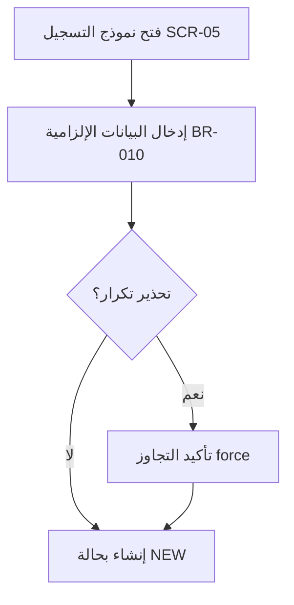
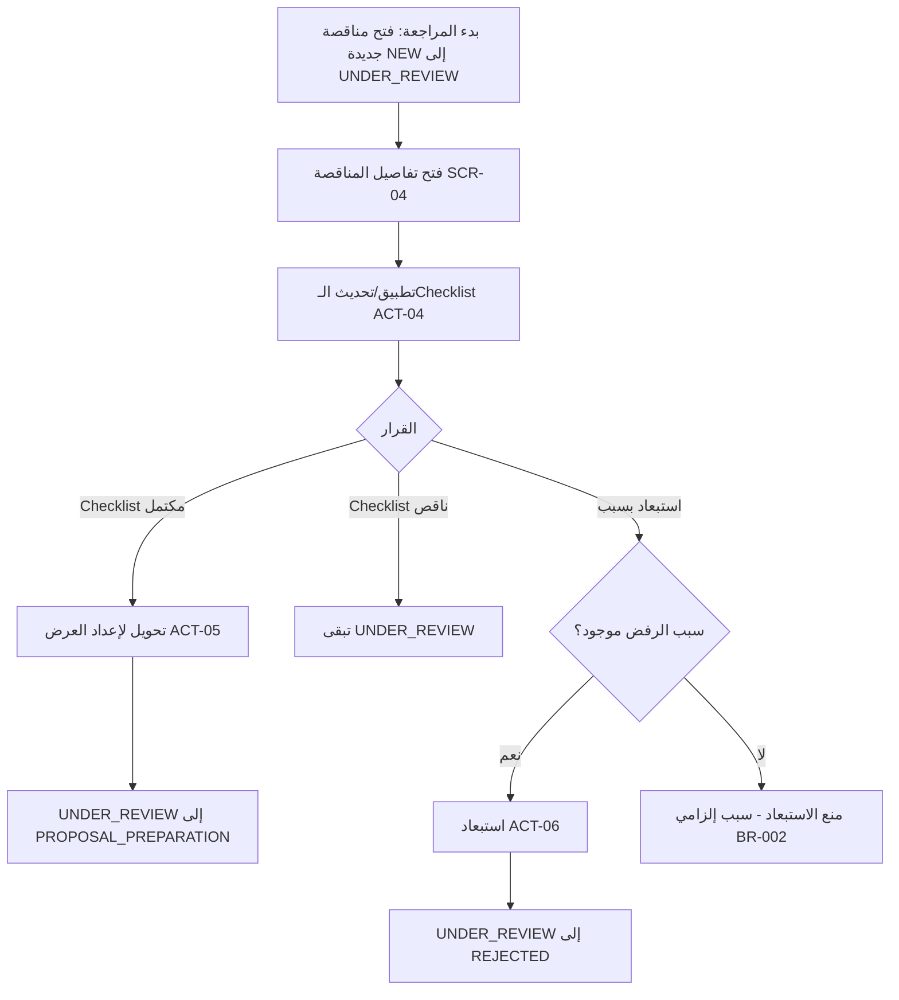
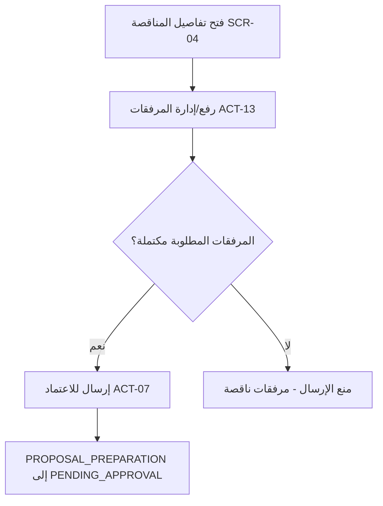
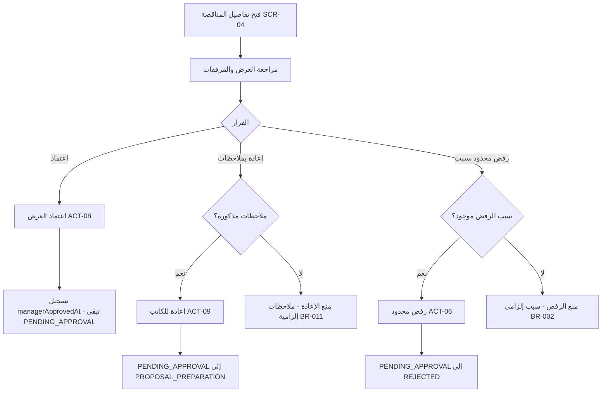
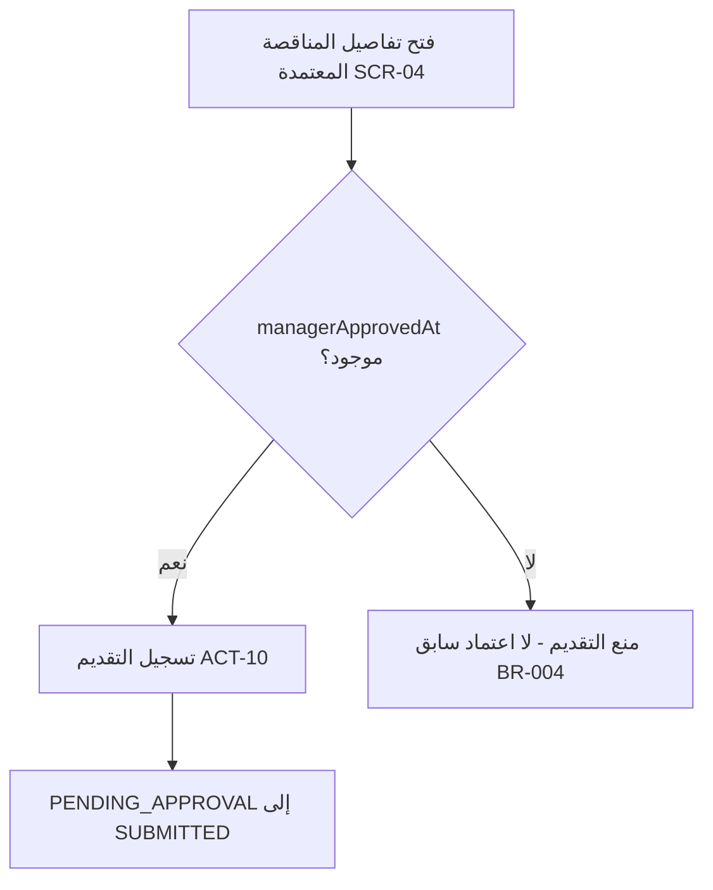
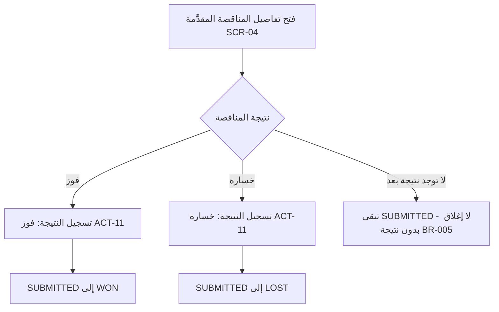
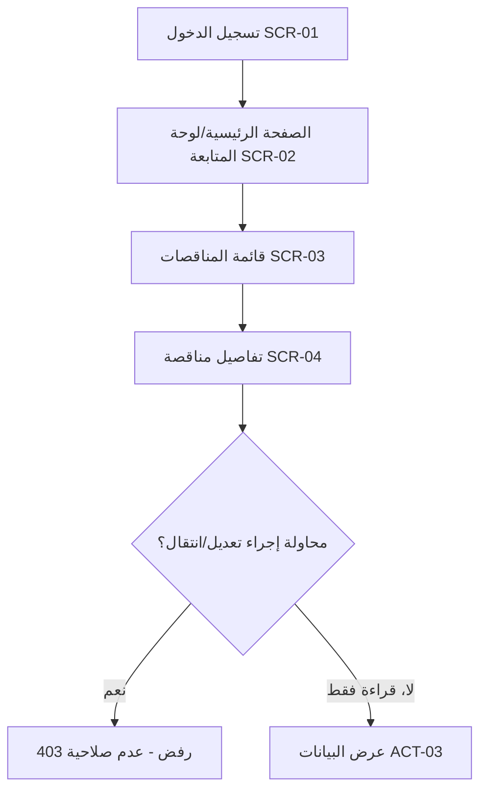

# 03 — رحلات المستخدمين (User Journeys)

## الغرض والمصدر

هذا المستند يوثّق رحلات المستخدمين الرئيسية (`JRN-xxx`) عبر دورة حياة المناقصة في نظام إدارة المناقصات. كل رحلة تمثّل تسلسل خطوات يقوم بها دور واحد أو أكثر، وتُبنى مباشرة على:

- **قواعد العمل وجدول انتقال الحالات** في `01-business-rules-catalogue.md` (`BR-xxx`، أسماء الحالات `TenderStatus`).
- **كتالوج الإجراءات ومصفوفة الصلاحيات** في `02-roles-permissions-matrix.md` (`ACT-xxx`، الأدوار الخمسة).

لكل رحلة قسم يحوي مخطط تدفّق (Mermaid `flowchart TD`) وجدول خطوات بالأعمدة: **الخطوة | الدور | الحالة قبل | الحالة بعد | القاعدة | الشاشة | نقطة فشل محتملة**. الحالات المذكورة (`NEW`, `UNDER_REVIEW`, `REJECTED`, `PROPOSAL_PREPARATION`, `PENDING_APPROVAL`, `SUBMITTED`, `WON`, `LOST`) مطابقة تمامًا لتعداد `TenderStatus`، والأدوار (`QA`, `WRITER`, `MANAGER`, `OWNER`, `ADMIN`) مطابقة لتعداد `Role` وتسمياتها بالعربية في `apps/web/src/lib/labels.ts`. رمز `—` في عمودَي الحالة يعني أن الخطوة لا تُغيّر ولا تعتمد على حالة مناقصة محدّدة (مثال: تسجيل الدخول)، ورمز `(أي حالة)` يعني أن الخطوة قراءة فقط ولا تتقيّد بحالة معيّنة.

الشاشات المُشار إليها (`SCR-01`…`SCR-06`) تُعرَّف رسميًا في `04-screen-inventory-and-specs.md`؛ هنا تُستخدم كمعرّفات مرجعية فقط:

| المعرّف | الشاشة |
|---|---|
| SCR-01 | تسجيل الدخول |
| SCR-02 | الصفحة الرئيسية / لوحة المتابعة |
| SCR-03 | قائمة المناقصات |
| SCR-04 | تفاصيل المناقصة (تبويبا التفاصيل/المراجعة + شريط الإجراءات) |
| SCR-05 | نموذج المناقصة (إنشاء/تعديل) |
| SCR-06 | إدارة المستخدمين (Admin) |
| SCR-07 | مهامي (My Tasks) |

> **تحديث M3 + M4 (حالة التنفيذ):** جميع رحلات دورة الحياة أدناه (JRN-02 حتى JRN-06) صارت **منفّذة فعليًا** في الكود عبر انتقالات الـState Machine المركزية (`services/tenderWorkflow.ts`). تُنفَّذ إجراءات المراجعة والـChecklist داخل تبويب "المراجعة" في SCR-04، وتظهر أزرار انتقالات سير العمل ديناميكيًا في **شريط الإجراءات (ActionsBar)** أعلى SCR-04 حسب (الحالة + الدور). أُضيفت شاشة **SCR-07 "مهامي"** التي تعرض للمستخدم مناقصاته حسب دوره (QA/WRITER: المعيّنة له؛ MANAGER: بانتظار اعتماده). الاستثناء الوحيد الباقي: خطوة "رفع/إدارة المرفقات (ACT-13)" في JRN-03 لا تزال **مخطّطة (M5)** — أما "إرسال للاعتماد (ACT-07)" في الرحلة نفسها فمنفّذ.

## قائمة الرحلات

| المعرّف | الرحلة | الدور الرئيسي | الإجراءات المرتبطة |
|---|---|---|---|
| JRN-01 | تسجيل مناقصة | QA | ACT-01 |
| JRN-02 | مراجعة QA | QA | ACT-04 / ACT-05 / ACT-06 |
| JRN-03 | إعداد العرض | WRITER | ACT-13 / ACT-07 |
| JRN-04 | اعتماد المدير | MANAGER | ACT-08 / ACT-09 / ACT-06 |
| JRN-05 | التقديم | MANAGER | ACT-10 |
| JRN-06 | تسجيل النتيجة | MANAGER | ACT-11 |
| JRN-07 | متابعة/قراءة | OWNER | ACT-03 |

---

## JRN-01 — تسجيل مناقصة

**الدور:** مراجع الجودة (QA). **الإجراء:** ACT-01. يفتح QA نموذج التسجيل (SCR-05)، يُدخل البيانات الإلزامية (BR-010)، وإذا رُصد تكرار محتمل يظهر تحذير قابل للتجاوز (`force`)، ثم تُنشأ المناقصة بحالة `NEW`.

| الخطوة | الدور | الحالة قبل | الحالة بعد | القاعدة | الشاشة | نقطة فشل محتملة |
|---|---|---|---|---|---|---|
| فتح نموذج التسجيل | QA | — | — | ACT-01 | SCR-05 | — |
| إدخال البيانات الإلزامية (موعد الإغلاق، الجهة المعلنة) | QA | — | — | BR-010 | SCR-05 | حقل إلزامي فارغ (موعد الإغلاق أو الجهة المعلنة) |
| تحذير تكرار محتمل وتأكيد التجاوز | QA | — | — | — | SCR-05 | تجاهل التحذير وإنشاء تكرار غير مقصود (`force`) |
| إنشاء المناقصة | QA | (غير موجودة) | NEW | BR-010 / ACT-01 | SCR-05 | فشل الحفظ في الخادم |

---

## JRN-02 — مراجعة QA

**الدور:** مراجع الجودة (QA). **الإجراءات:** ACT-04 (الـChecklist)، ACT-05 (تحويل)، ACT-06 (استبعاد مبكر). تبدأ الرحلة ببدء المراجعة: يفتح QA مناقصة جديدة (`NEW`) فتنتقل إلى `UNDER_REVIEW` (الانتقال `NEW → UNDER_REVIEW` المنسوب لـQA في `01-business-rules-catalogue.md`). ثم يطبّق الـChecklist (BR-001)؛ عند الاكتمال يحوّلها لإعداد العرض، أو يستبعدها بسبب إلزامي (BR-002). هذا هو الاستبعاد المبكر `UNDER_REVIEW → REJECTED` المنسوب لـQA حسب `02-roles-permissions-matrix.md` (بخلاف رفض مرحلة الاعتماد الذي يقوم به المدير في JRN-04).

| الخطوة | الدور | الحالة قبل | الحالة بعد | القاعدة | الشاشة | نقطة فشل محتملة |
|---|---|---|---|---|---|---|
| بدء المراجعة (فتح مناقصة جديدة) | QA | NEW | UNDER_REVIEW | — | SCR-04 | — |
| فتح تفاصيل المناقصة | QA | UNDER_REVIEW | UNDER_REVIEW | ACT-03 | SCR-04 | — |
| تطبيق/تحديث الـChecklist | QA | UNDER_REVIEW | UNDER_REVIEW | BR-001 / ACT-04 | SCR-04 | Checklist غير مكتمل يمنع التحويل |
| تحويل لإعداد العرض (عند اكتمال الـChecklist) | QA | UNDER_REVIEW | PROPOSAL_PREPARATION | BR-001 / ACT-05 | SCR-04 | محاولة تحويل قبل اكتمال الـChecklist |
| استبعاد المناقصة (رفض مبكر بسبب) | QA | UNDER_REVIEW | REJECTED | BR-002 / ACT-06 | SCR-04 | سبب الرفض غير مذكور (إلزامي) |

---

## JRN-03 — إعداد العرض

**الدور:** كاتب العروض (WRITER). **الإجراءات:** ACT-13 (المرفقات)، ACT-07 (إرسال للاعتماد). يستلم WRITER المناقصة بعد تحويلها من QA، يرفع المرفقات المطلوبة، ثم يرسلها للاعتماد فتنتقل إلى `PENDING_APPROVAL` (BR-004).

| الخطوة | الدور | الحالة قبل | الحالة بعد | القاعدة | الشاشة | نقطة فشل محتملة |
|---|---|---|---|---|---|---|
| فتح تفاصيل المناقصة (بعد التحويل من QA) | WRITER | PROPOSAL_PREPARATION | PROPOSAL_PREPARATION | ACT-03 | SCR-04 | — |
| رفع/إدارة المرفقات | WRITER | PROPOSAL_PREPARATION | PROPOSAL_PREPARATION | ACT-13 | SCR-04 | ملف بصيغة/حجم غير مدعوم |
| إرسال للاعتماد | WRITER | PROPOSAL_PREPARATION | PENDING_APPROVAL | BR-004 / ACT-07 | SCR-04 | إرسال بلا مرفقات مطلوبة |

---

## JRN-04 — اعتماد المدير

**الدور:** المدير (MANAGER). **الإجراءات:** ACT-08 (اعتماد)، ACT-09 (إعادة بملاحظات)، ACT-06 (رفض محدود في مرحلة الاعتماد). يراجع المدير العرض؛ إما يعتمده (يسجَّل `managerApprovedAt` وتبقى الحالة `PENDING_APPROVAL` بانتظار تسجيل التقديم في JRN-05)، أو يعيده للكاتب بملاحظات إلزامية (BR-011)، أو يرفضه برفض محدود بسبب إلزامي (BR-002) — وهو رفض مرحلة الاعتماد `PENDING_APPROVAL → REJECTED` المنسوب للمدير بصلاحية **محدودة** حسب `02-roles-permissions-matrix.md`، بخلاف الاستبعاد المبكر الذي يقوم به QA في JRN-02.

| الخطوة | الدور | الحالة قبل | الحالة بعد | القاعدة | الشاشة | نقطة فشل محتملة |
|---|---|---|---|---|---|---|
| فتح تفاصيل المناقصة ومراجعة العرض | MANAGER | PENDING_APPROVAL | PENDING_APPROVAL | ACT-03 | SCR-04 | — |
| اعتماد العرض (تسجيل `managerApprovedAt`) | MANAGER | PENDING_APPROVAL | PENDING_APPROVAL | BR-004 / ACT-08 | SCR-04 | الحالة لا تتغيّر فعليًا إلى SUBMITTED إلا عبر تسجيل التقديم في JRN-05 |
| إعادة للكاتب بملاحظات | MANAGER | PENDING_APPROVAL | PROPOSAL_PREPARATION | BR-011 / ACT-09 | SCR-04 | إعادة بلا ملاحظات |
| رفض العرض (محدود، مرحلة الاعتماد) | MANAGER | PENDING_APPROVAL | REJECTED | BR-002 / ACT-06 | SCR-04 | رفض بلا سبب إلزامي |

---

## JRN-05 — التقديم

**الدور:** المدير (MANAGER). **الإجراء:** ACT-10. بعد اعتماد المدير (`managerApprovedAt` موجود، BR-004)، يسجّل المدير التقديم الفعلي فتنتقل المناقصة إلى `SUBMITTED`.

| الخطوة | الدور | الحالة قبل | الحالة بعد | القاعدة | الشاشة | نقطة فشل محتملة |
|---|---|---|---|---|---|---|
| فتح تفاصيل المناقصة المعتمدة | MANAGER | PENDING_APPROVAL | PENDING_APPROVAL | ACT-03 | SCR-04 | — |
| التحقق من وجود اعتماد سابق (`managerApprovedAt`) | MANAGER | PENDING_APPROVAL | PENDING_APPROVAL | BR-004 | SCR-04 | تقديم بلا اعتماد سابق |
| تسجيل التقديم | MANAGER | PENDING_APPROVAL | SUBMITTED | BR-004 / ACT-10 | SCR-04 | فشل حفظ بيانات التقديم |

---

## JRN-06 — تسجيل النتيجة

**الدور:** المدير (MANAGER). **الإجراء:** ACT-11. بعد التقديم، يسجّل المدير نتيجة المناقصة فوزًا أو خسارة (BR-005)؛ لا يجوز إغلاق مناقصة مُقدَّمة بدون نتيجة.

| الخطوة | الدور | الحالة قبل | الحالة بعد | القاعدة | الشاشة | نقطة فشل محتملة |
|---|---|---|---|---|---|---|
| فتح تفاصيل المناقصة المقدَّمة | MANAGER | SUBMITTED | SUBMITTED | ACT-03 | SCR-04 | — |
| تسجيل النتيجة: فوز | MANAGER | SUBMITTED | WON | BR-005 / ACT-11 | SCR-04 | إغلاق بلا نتيجة فعلية |
| تسجيل النتيجة: خسارة | MANAGER | SUBMITTED | LOST | BR-005 / ACT-11 | SCR-04 | إغلاق بلا نتيجة فعلية |

---

## JRN-07 — متابعة/قراءة

**الدور:** المالك (OWNER). **الإجراء:** ACT-03. دور اطّلاع (قراءة فقط) دون أي صلاحية على انتقالات الحالة أو التعديل؛ يفتح القوائم والتفاصيل للمتابعة فقط، وأي محاولة إجراء غير مسموح تُرفض.

| الخطوة | الدور | الحالة قبل | الحالة بعد | القاعدة | الشاشة | نقطة فشل محتملة |
|---|---|---|---|---|---|---|
| تسجيل الدخول | OWNER | — | — | — | SCR-01 | بيانات اعتماد خاطئة |
| فتح الصفحة الرئيسية/لوحة المتابعة | OWNER | — | — | ACT-03 | SCR-02 | — |
| فتح قائمة المناقصات (قراءة فقط) | OWNER | (أي حالة) | (أي حالة) | ACT-03 | SCR-03 | — |
| فتح تفاصيل مناقصة (قراءة فقط) | OWNER | (أي حالة) | (أي حالة) | ACT-03 | SCR-04 | محاولة إجراء غير مسموح (تعديل/انتقال) → رفض 403 |

